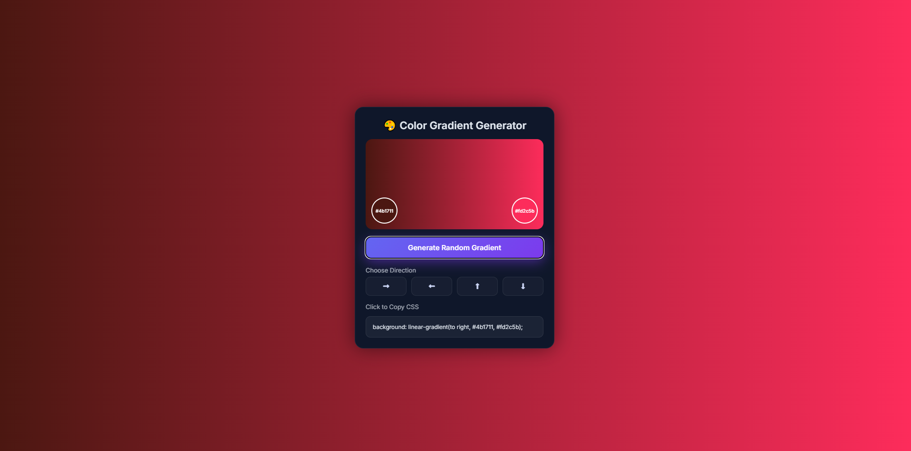
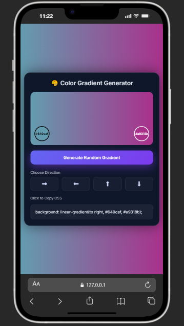

# 🎨 Random Gradient Generator

🚀 **Live Demo:**
🔗 [Live Demo](https://gradient.webdevzone.in)

A modern and lightweight web app that generates **beautiful random color gradients** with a single click. Built using pure HTML, CSS, and JavaScript, this project is perfect for developers and designers looking for UI inspiration.

---

## ✨ Key Highlights

- ⚡ Fast and lightweight (no frameworks)
- 🎨 Generates unique gradients every time
- 📱 Fully responsive design
- 🧑‍💻 Beginner-friendly code structure
- 🎯 Clean and modern UI
- 🎛️ Interactive gradient direction control

---

## 🛠️ Tech Stack

- HTML5
- CSS3
- JavaScript

---

## 🚀 Features

- 🎲 Generate random gradient colors instantly
- 🌈 Smooth and visually appealing gradients
- 🖱️ One-click gradient generation
- 📋 Copy CSS gradient code instantly
- 🔄 Direction control (Top, Bottom, Left, Right)
- 💡 Great for UI/UX inspiration

---

## 📸 Screenshots

📸 
📸 

---

## ⚙️ Installation

Follow these steps to run the project locally:

```bash
# 1. Clone the repository
git clone https://github.com/webdev-desktop/Random-Gradient-Generator.git

# 2. Navigate into the project folder
cd random-gradient-generator

# 3. Open index.html in your browser
```

---

## 🧑‍💻 Usage

1. Open the app in your browser
2. Click on the **Generate** button
3. Choose gradient direction (Top / Bottom / Left / Right)
4. Copy the CSS code instantly
5. Use it in your UI/design projects 🎨

---

## 🔮 Future Improvements

- 💾 Save favorite gradients
- 🎛️ Advanced angle control (custom degrees like 45°, 90°)
- 🌙 Dark/Light mode toggle
- 📤 Export gradients as image

---

## 🤝 Contribution

Contributions are always welcome!

If you'd like to improve this project:

1. Fork the repository
2. Create a new branch (`feature/your-feature-name`)
3. Commit your changes
4. Push to your branch
5. Open a Pull Request 🚀

---

## 👨‍💻 Author

**Apurv**
🔗 [Github](https://github.com/webdev-desktop)

---

## 📄 License

This project is licensed under the **MIT License**.

---

⭐ If you like this project, don't forget to give it a star!
